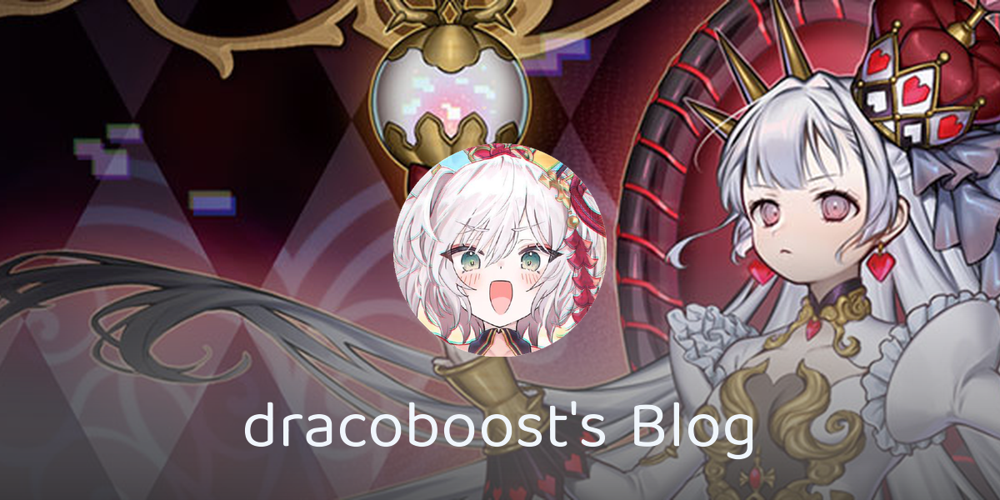
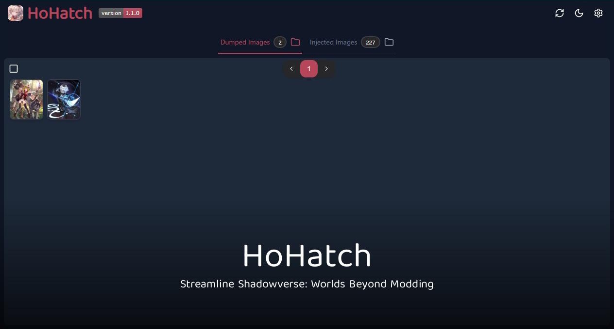
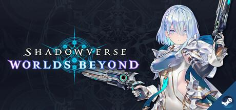

<!-- Profile Card -->
<h1 align="center">Hi there, I'm dracoboost</h1>

<!-- Works -->
<h2 align="center">🐤 Works</h2>
<table align="center">
  <tbody>
    <tr>
      <td align="center" width="33%" valign="top">
        <a href="https://www.draco.moe" target="_blank" rel="noopener noreferrer">
          
          
<b>Blog</b>

        </a>
      </td>
      <td align="center" width="33%" valign="top">
        <a href="https://hohatch.draco.moe" target="_blank" rel="noopener noreferrer">
          
          
<b>HoHatch - Image Converter for shadowverse: Worlds Beyond</b>

        </a>
      </td>
      <td align="center" width="33%" valign="top">
      </td>
    </tr>
  </tbody>
</table>

<!-- Favorite Games -->
<h2 align="center">🎮 Favorite Games</h2>

<table align="center">
  <tbody>
    <tr>
      <td align="center" width="33%" valign="top">
        <a href="https://store.steampowered.com/app/1449850/YuGiOh_Master_Duel/" target="_blank" rel="noopener noreferrer">
          
          
<b>Yu-Gi-Oh! Master Duel</b>

        </a>
      </td>
      <td align="center" width="33%" valign="top">
        <a href="https://store.steampowered.com/app/2584990/Shadowverse_Worlds_Beyond/" target="_blank" rel="noopener noreferrer">
          
          
<b>Shadowverse: Worlds Beyond</b>

        </a>
      </td>
      <td align="center" width="33%" valign="top">
        <a href="https://store.steampowered.com/app/881020/GRANBLUE_FANTASY_Relink/" target="_blank" rel="noopener noreferrer">
          
          
<b>GRANBLUE FANTASY: Relink</b>

        </a>
      </td>
    </tr>
    <tr>
      <td align="center" width="33%" valign="top">
        <a href="https://www.dlsite.com/pro/work/=/product_id/VJ013196.html" target="_blank" rel="noopener noreferrer">
          
          
<b>Maitetsu</b>

        </a>
      </td>
      <td align="center" width="33%" valign="top">
        <a href="https://store-jp.nintendo.com/item/software/D70010000058127" target="_blank" rel="noopener noreferrer">
          
          
<b>OCTOPATH TRAVELER II</b>

        </a>
      </td>
      <td align="center" width="33%" valign="top">
        <a href="https://store.steampowered.com/app/2679460/_/" target="_blank" rel="noopener noreferrer">
          
          
<b>Metaphor: ReFantazio</b>

        </a>
      </td>
    </tr>
    <!-- <tr>
      <td align="center" width="33%" valign="top">
        <a href="https://store.steampowered.com/app/740130/Tales_of_ARISE/" target="_blank" rel="noopener noreferrer">
          
          
<b>Tales of ARISE</b>

        </a>
      </td>
      <td align="center" width="33%" valign="top">
        <a href="https://store.steampowered.com/app/391540/Undertale/" target="_blank" rel="noopener noreferrer">
          
          
<b>Undertale</b>

        </a>
      </td>
    </tr> -->
    <!-- <tr>
      <td align="center" width="33%" valign="top">
        <a href="https://store-jp.nintendo.com/item/software/D70010000067814" target="_blank" rel="noopener noreferrer">
          
        <d  iv><b>Romancing SaGa 2: Revenge of the Seven</b>

        </a>
      </td> -->
    </tr>
  </tbody>
</table>
